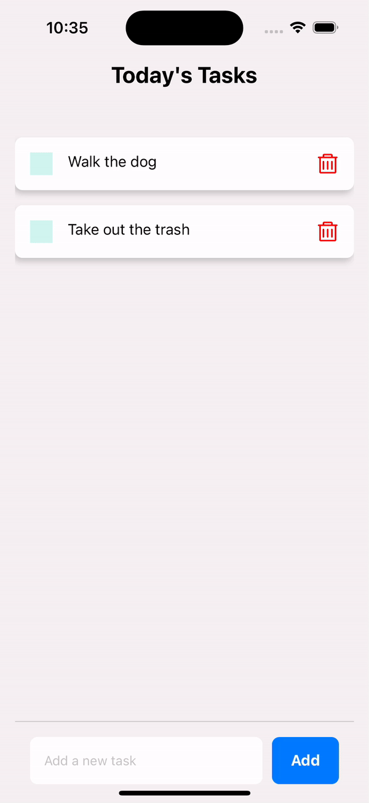

# DIS-todo-mobile

This is a cleint server for a mobile app for a todo list!

It is built with React Native and uses the Expo framework.

Backend Server: https://github.com/Milttam/DIS-todo-server

## Example Usage

